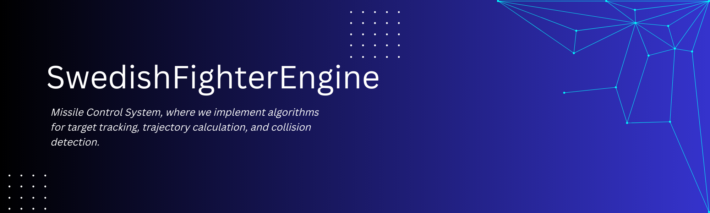

# SwedishFighterEngine - Guided Missile Control System



## Overview

Welcome to the **Guided Missile Control System**, a comprehensive software solution for simulating and controlling guided missile behavior. This system includes modules for missile trajectory calculation, target tracking, sensor simulations, and much more. It is designed to support military-grade missile control systems and is intended for research, simulation, and training purposes.

This project is modular, scalable, and designed with real-world military applications in mind, making it an ideal platform for missile system developers, researchers, and defense engineers.

## Features

This system is composed of several highly-specialized modules, each addressing different aspects of missile control and simulation:

1. **Missile Trajectory Calculation**  
   Computes precise flight paths based on missile properties (e.g., weight, dimensions, propulsion) and environmental factors.
   
2. **Target Tracking**  
   Uses advanced algorithms to track moving targets in real-time, predicting their movements and adjusting missile behavior accordingly.

3. **Sensor and Guidance Simulation**  
   Simulates various missile guidance sensors such as infrared, radar, and GPS, allowing for realistic guidance under different conditions.

4. **Interception Algorithms**  
   Implements strategies and algorithms for missile interception, optimized for various types of targets and situations.

5. **Environmental Conditions Simulation**  
   Models weather effects, air pressure, wind, and other environmental variables that affect missile performance.

6. **Explosion and Damage Simulation**  
   Simulates the missile's explosive impact and damage radius, calculating potential damage based on proximity to the target.

7. **Target Evasive Maneuvers Simulation**  
   Models evasive actions from targets, forcing the missile to dynamically adjust its trajectory and guidance system.

8. **Autonomous Guidance Control**  
   Implements algorithms for autonomous missile guidance, including adjustments for mid-flight course corrections without human intervention.

9. **Countermeasure Simulation**  
   Simulates various countermeasures deployed by the target, such as flares, chaff, and electronic warfare tactics, with the missile responding accordingly.

10. **External Systems Communication Interface**  
    Provides interfaces to communicate with external systems, including real-time military command centers, radar systems, and other control units.

## Getting Started

### Prerequisites

- **C++17 or later**  
  The core of the system is developed in modern C++ for high performance.
  
- **CMake**  
  We use CMake for building and configuring the project. Ensure you have version 3.20+ installed.

- **Ninja**  
  For fast builds, we recommend using the Ninja build system.

- **vcpkg**  
  Dependency management is handled via vcpkg. Ensure vcpkg is installed and set up in your environment.

### Building the Project

1. Clone the repository:
   ```bash
   git clone https://github.com/yourusername/guided-missile-control.git
   cd guided-missile-control

## Contributing
We welcome contributions from the open-source community! Feel free to submit pull requests, raise issues, or suggest features.

Contribution Steps
Fork the repository.
Create a new branch (git checkout -b feature/your-feature-name).
Make your changes and commit them (git commit -m 'Add some feature').
Push to the branch (git push origin feature/your-feature-name).
Open a pull request and explain the changes you’ve made.
License
This project is licensed under the MIT License. See the LICENSE file for more details.